# Exno:1-Data Cleaning Process
### Name:Ashwin AKash M
### Register Number: 212223230024
### Department : Artificial Intelligence amd Data Science
# AIM
To read the given data and perform data cleaning and save the cleaned data to a file.

# Explanation
Data cleaning is the process of preparing data for analysis by removing or modifying data that is incorrect ,incompleted , irrelevant , duplicated or improperly formatted. Data cleaning is not simply about erasing data ,but rather finding a way to maximize datasets accuracy without necessarily deleting the information.

# Algorithm
STEP 1: Read the given Data

STEP 2: Get the information about the data

STEP 3: Remove the null values from the data

STEP 4: Save the Clean data to the file

STEP 5: Remove outliers using IQR

STEP 6: Use zscore of to remove outliers

# Coding and Output
### Colab Link:
https://colab.research.google.com/drive/1NyAt4-fQSF9rTfg_UV2anMBzG6PZnj5Q?usp=sharing
### Cleaning process
```
import pandas as pd
data={'Name':['Alice','Bob','Charlie','Dave','Eve'],'Age':[25,32,None,41,28],'Salary':[50000,None,70000,90000,60000]}
df=pd.DataFrame(data)
df
```

```
#remove the missing value in the salary with the particular row
df_clean=df.dropna(subset=['Salary'])
df_clean
```

```
#the row with complete missing value then the row get deleted
df_clean_all=df.dropna(how='all')
df_clean_all
```
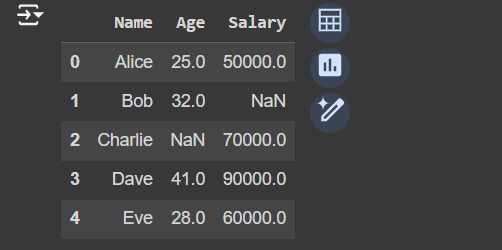
```
#delete the row which contain one missing value
df_cleaned_any=df.dropna(how='any')
df_cleaned_any
```
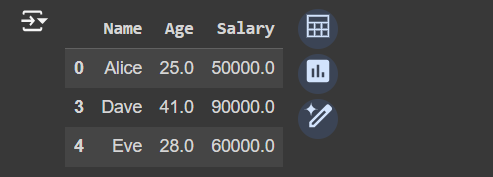
```
import pandas as pd
import numpy as np
data={'Name':['Alice','Bob','Charlie','Dave','Eve','Bob','Charlie'],'Age':[25,np.nan,35,41,np.nan,np.nan,85],'Salary':[50000,np.nan,70000,np.nan,60000,np.nan,70000]}
df=pd.DataFrame(data)
df
```
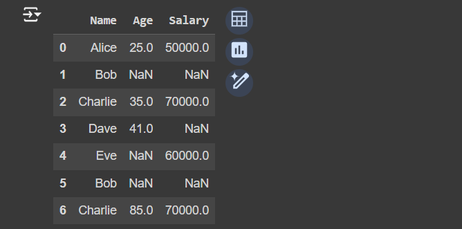
```
~df.duplicated()
```

```
df_clean=df.dropna(how='any')
df_clean
```

```
#replace the nan with replace of an value
df_filled=df.fillna(0)
df_filled
```
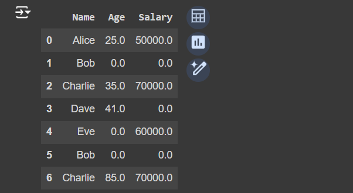
```
#forward fill where it will fill the before data set
df_ffill=df.fillna(method='ffill')
df_ffill
```

```
#where it will fill the back ward data into the current data
df_bfill=df.bfill()
df_bfill
```
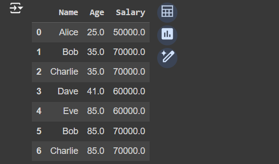
```
#to find the mean of an age
df_mean=df.fillna(df['Age'].mean())
df_mean
```
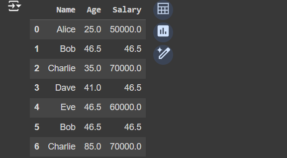

### Outlier detection and removal process
```
import pandas as pd
import seaborn as sns
import numpy as np
df=pd.read_csv('iris (1).csv')
df
```
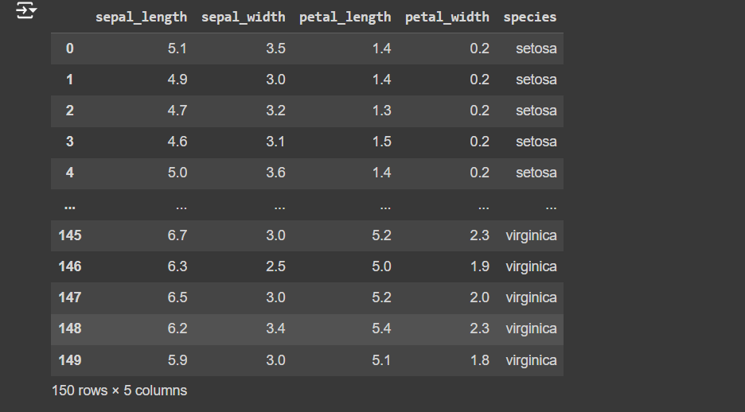
```
sns.boxplot(data=df['sepal_width'])
```
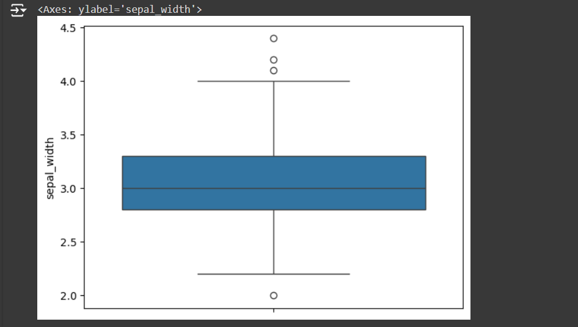
```
sns.boxenplot(data=df['sepal_width'])
```
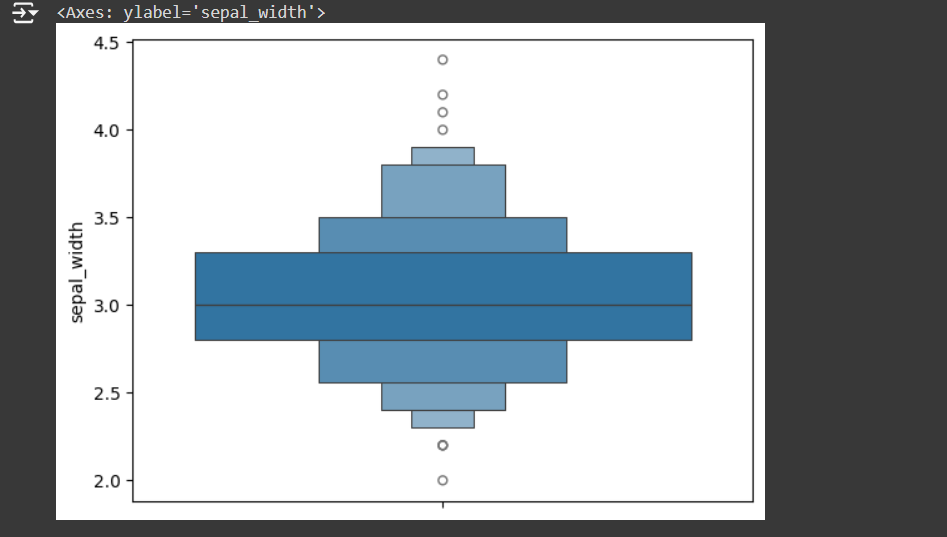
```
q1=df['sepal_width'].quantile(0.25)
q3=df['sepal_width'].quantile(0.75)
IQR=q3-q1
IQR
```

```
lower_bound=q1-1.5*IQR
upper_bound=q3+1.5*IQR
print(lower_bound,upper_bound)
```

```
print("Q1:",q1)
print("Q3:",q3)
print("IQR:",IQR)
print("Lower Bound:",lower_bound)
print("Upper_bound:",upper_bound)
```
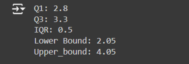
```
dt=df[(df['sepal_width']>=lower_bound) & (df['sepal_width']<=upper_bound)]
dt
```
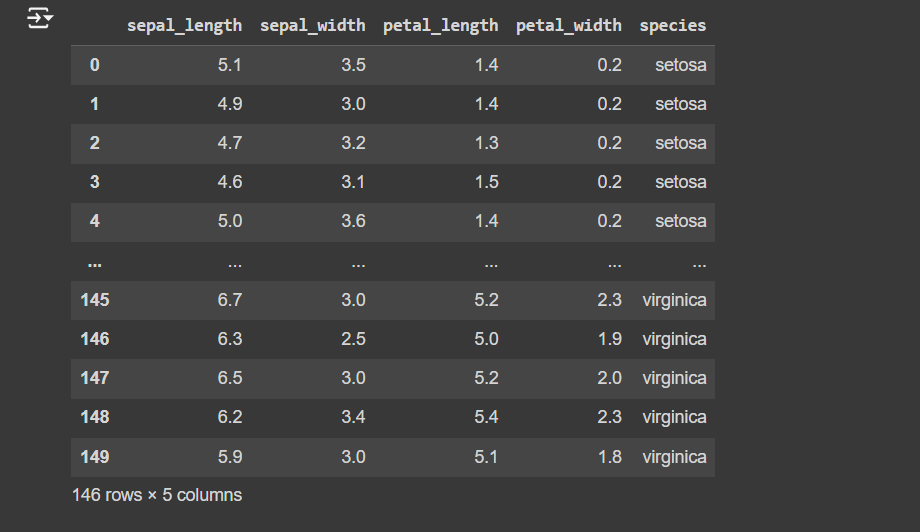
```
dt['sepal_width'].dropna()
```
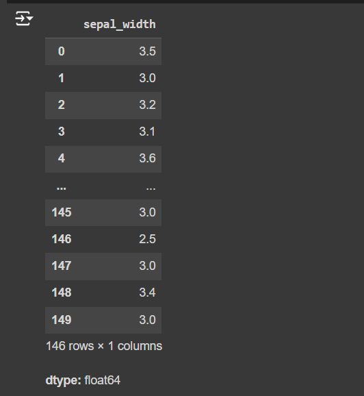
```
sns.boxplot(data=dt['sepal_width'])
```
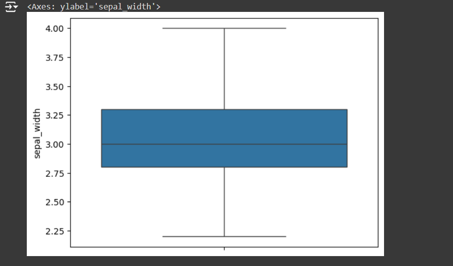
```
sns.boxenplot(data=dt['sepal_width'])
```

```
sns.scatterplot(data=dt['sepal_width'])
```
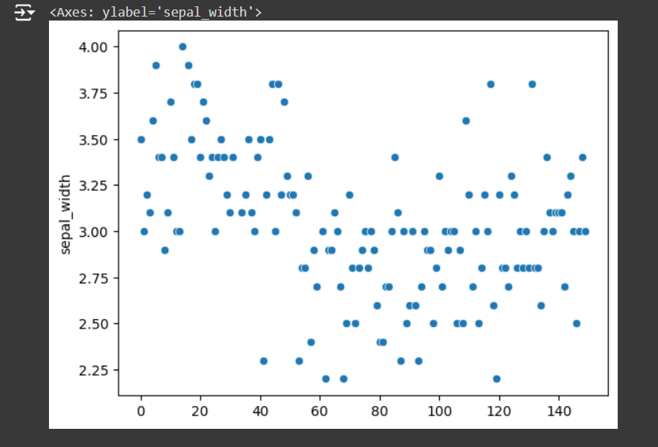


# Result
Hence,the data cleaning process and the detection of outlier and removal of it has been done successfully.
